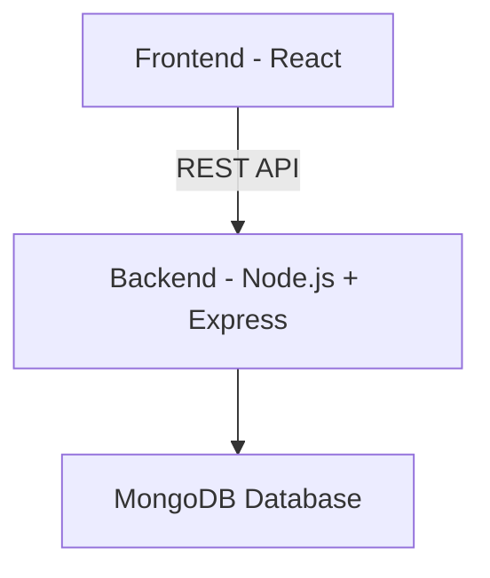
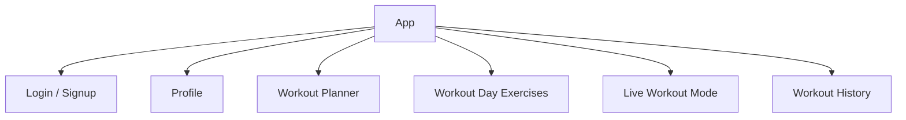

# 🏋️‍♂️ FitFlow — Architecture, HLD, LLD & Folder Structure

**Tagline:** Plan your workouts. Track your progress. Stay consistent.

---

## 🛠️ Tech Stack

### **Frontend (Client / Presentation Layer)**

* React + Vite
* TailwindCSS / Material UI
* Axios (REST API calls)
* Optional: Service Workers / Notifications

### **Backend (Server / Application Layer)**

* Node.js + Express.js
* MongoDB (Database)
* JWT (Authentication)

**Microservices:**

> Single backend service is enough (scope manageable)
> Frontend is a client application, not a microservice

---

## 🔧 Work of Layers

### **Frontend**

* Shows workout planner UI
* Manages workout day & exercise management
* Handles live workout timer UI
* Shows logs & history
* Calls backend APIs

### **Backend**

* Authentication & user handling
* Workout day & exercise CRUD logic
* Live workout logging
* History & suggestion logic

### **Database Layer**

* Collections: Users, WorkoutDays, Exercises, WorkoutLogs, SetLogs

---

## 🏗️ High-Level Design (HLD)



### **HLD Summary:**

* Frontend calls backend using REST APIs
* Backend handles authentication + business logic
* MongoDB stores all core data
* Single backend application — simple & scalable

---

## 📐 Low-Level Design (LLD)

### **1️⃣ Users Collection**

Stores user fitness profile:

```
{
  _id,
  name,
  email,
  password,
  age,
  height,
  weight,
  goal,  // muscle_gain, fat_loss, strength, stay_fit
  createdAt,
  updatedAt
}
```

---

### **2️⃣ WorkoutDays Collection**

Stores custom workout day names like Chest Day, Leg Day etc.

```
{
  _id,
  userId,
  title,
  createdAt,
  updatedAt
}
```

---

### **3️⃣ Exercises Collection**

Stores exercises inside each workout day.

```
{
  _id,
  userId,
  dayId,
  exerciseName,
  imageUrl,
  sets,
  reps,
  restTime,
  notes
}
```

---

### **4️⃣ WorkoutLogs Collection**

Stores daily workout results.

```
{
  _id,
  userId,
  dayId,
  date,
  totalExercises,
  totalSetsCompleted,
  status // completed / skipped
}
```

---

### **5️⃣ SetLogs Collection (Optional)**

Stores each set-level tracking.

```
{
  _id,
  userId,
  exerciseId,
  setNumber,
  completedAt,
  timeTaken
}
```

---

## 🔗 API Endpoints

### **AuthRouter**

| Method | Endpoint | Description       |
| ------ | -------- | ----------------- |
| POST   | /signup  | Register new user |
| POST   | /login   | Login user        |
| POST   | /logout  | Logout user       |

---

### **ProfileRouter**

| Method | Endpoint | Description  |
| ------ | -------- | ------------ |
| GET    | /profile | Get profile  |
| PATCH  | /profile | Edit profile |

---

### **WorkoutDayRouter**

| Method | Endpoint         | Description        |
| ------ | ---------------- | ------------------ |
| POST   | /workout/day     | Create workout day |
| GET    | /workout/days    | Get workout days   |
| DELETE | /workout/day/:id | Delete workout day |

---

### **ExerciseRouter**

| Method | Endpoint         | Description             |
| ------ | ---------------- | ----------------------- |
| POST   | /exercise        | Add exercise            |
| GET    | /exercise/:dayId | Get exercises for a day |
| PATCH  | /exercise/:id    | Update exercise         |
| DELETE | /exercise/:id    | Delete exercise         |

---

### **Workout Execution APIs**

| Method | Endpoint             | Description           |
| ------ | -------------------- | --------------------- |
| POST   | /workout/start       | Start workout session |
| POST   | /workout/setComplete | Mark set complete     |
| POST   | /workout/complete    | Finish workout        |

---

### **History APIs**

| Method | Endpoint            | Description           |
| ------ | ------------------- | --------------------- |
| GET    | /workout/history    | Get workout history   |
| GET    | /workout/last       | Get last workout      |
| GET    | /workout/suggestion | Suggest today workout |

---

## 🖼️ Frontend Component Diagram



---

## 📂 Folder Structure – FitFlow

```
FitFlow/
│
├── src/
│   │   ApiList.md
│   │   app.js                 # Backend entry
│   │   notes.md
│
│   ├── config/
│   │       database.js
│
│   ├── middlewares/
│   │       auth.js
│
│   ├── models/
│   │       user.js
│   │       workoutDay.js
│   │       exercise.js
│   │       workoutLog.js
│   │       setLog.js
│
│   ├── routes/
│   │       authRouter.js
│   │       profileRouter.js
│   │       workoutRouter.js
│   │       exerciseRouter.js
│   │       historyRouter.js
│
│   └── utils/
│           validation.js
│
├── .env
├── .gitignore
├── package-lock.json
├── package.json
└── README.md
```

---

## 🌟 Optional Advanced Features

* Streak tracking
* Charts / Analytics
* Notifications
* Gamification badges
* AI workout suggestion (future)

---

**🎯 Summary:**
FitFlow is a discipline-focused fitness companion — structured architecture, clean backend, powerful UI, and scalable design.
