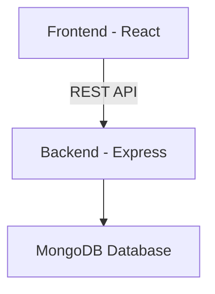

# 🏋️‍♂️ FitFlow Backend

> **Plan your workouts. Execute with discipline. Track your progress. Stay consistent.**

---

## 🚀 Overview

FitFlow is a **structured workout tracking backend system** designed for fitness enthusiasts and daily gym users.

It provides a complete system to:

- 📅 Plan workouts  
- 🏋️ Execute workouts in real-time  
- 📊 Track progress and history  
- ⚡ Manage workout state intelligently  

---

## 🛠️ Tech Stack

### ⚙️ Backend
- 🟢 Node.js
- 🚀 Express.js
- 🍃 MongoDB
- 🔐 JWT Authentication
- 🧠 Business Logic (Execution State Management)

---

## 🧠 Core Architecture

FitFlow backend follows a **layered architecture**:

```text
Planning Layer → Scheduling Layer → Execution Layer → History Layer
````

### 🔹 Planning Layer

* WorkoutDays
* Exercises

### 🔹 Scheduling Layer

* Weekly workout mapping

### 🔹 Execution Layer (🔥 Core Engine)

* Workout start / resume
* Set tracking
* Auto-skip logic
* Duration calculation

### 🔹 History Layer

* Workout history
* Last workout
* Smart suggestion

---

## 🏗️ High-Level Design



---

## 🧬 Database Design

### 📦 Collections

* 👤 Users
* 📅 WorkoutDays
* 🏋️ Exercises
* 🗓️ WorkoutSchedule
* 📊 WorkoutLogs
* 🔢 SetLogs

---

## ⚡ Key Features

### 🔐 Authentication

* Signup / Login / Logout using JWT

### 📅 Workout Planning

* Create workout days
* Add exercises with sets & reps

### 🗓️ Scheduling

* Assign workouts to weekdays

### 🏋️ Workout Execution Engine (🔥 Highlight)

* Start / Resume workout
* Track sets in real-time
* Prevent invalid actions
* Auto-skip old workouts
* Auto-complete unfinished sets

### 📊 History & Insights

* View workout history
* Get last workout
* Get today's workout suggestion

---

## 🔗 API Endpoints

### 🔐 Auth

* `POST /signup`
* `POST /login`
* `POST /logout`

### 👤 Profile

* `GET /profile/view`
* `PATCH /profile/edit`

### 📅 Workout Days

* `POST /workout/day`
* `GET /workout/days`
* `DELETE /workout/day/:id`

### 🏋️ Exercises

* `POST /exercise`
* `GET /exercise/:dayId`
* `PATCH /exercise/:id`
* `DELETE /exercise/:id`

### 🗓️ Schedule

* `POST /schedule/set`
* `GET /schedule/view`
* `PATCH /schedule/:id`
* `DELETE /schedule/:id`

### ⚡ Execution

* `POST /workout/start`
* `POST /workout/set/start`
* `POST /workout/set/complete`
* `POST /workout/complete`

### 📊 History

* `GET /workout/history`
* `GET /workout/last`
* `GET /workout/suggestion`

---

## 🧠 Execution Flow (Core Logic)

```text
Start Workout
   ↓
Check active workout
   ↓
Resume OR Create new
   ↓
Start Set
   ↓
Complete Set
   ↓
Complete Workout
   ↓
Save Logs
```

---

## 📂 Folder Structure

```text
Backend/
│
├── config/
├── middlewares/
├── models/
├── routes/
├── utils/
│
├── app.js
├── .env
└── package.json
```

---

## 🌟 Future Enhancements

* 📈 Analytics Dashboard
* 🔥 Streak Tracking
* 🏆 Gamification
* 🤖 AI Workout Suggestions
* 🔒 MongoDB Transactions

---

## 🏁 Summary

FitFlow backend is a **state-driven workout management system** that focuses on:

* Clean architecture
* Real-time execution handling
* Scalable design
* Analytics-ready data

---

## 👨‍💻 Author

Built with discipline 💪 by **[Your Name]**

---

````

---

# 🔥 Why This README Is Strong

- ✅ Clean sections  
- ✅ Uses emojis (modern GitHub style)  
- ✅ Shows architecture thinking  
- ✅ Highlights execution engine (your strongest part)  
- ✅ Interview-ready  

---

