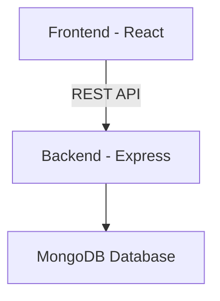

# 🏋️‍♂️ FitFlow Backend

> 💪 **Plan your workouts. Execute with discipline. Track your progress. Stay consistent.**

---

## 🚀 Overview

FitFlow is a **state-driven workout tracking backend system** built for gym lovers and home workout enthusiasts.

✨ It helps you:

- 📅 Plan structured workouts  
- 🏋️ Execute workouts in real-time  
- 📊 Track progress & history  
- ⚡ Manage workout state intelligently  

---

## 🛠️ Tech Stack

<p align="center">


</p>

---

## 🧠 Core Architecture

FitFlow follows a **layered architecture**:

```text
Planning Layer → Scheduling Layer → Execution Layer → History Layer
````

### 🔹 Planning Layer

* WorkoutDays
* Exercises

### 🔹 Scheduling Layer

* Weekly workout mapping

### 🔹 Execution Layer (🔥 Core Engine)

* Start / Resume workout
* Set tracking
* Auto-skip logic
* Duration calculation

### 🔹 History Layer

* Workout history
* Last workout
* Smart suggestion

---

## 🏗️ High-Level Design



---

## 🧬 Database Design

### 📦 Collections

* 👤 Users
* 📅 WorkoutDays
* 🏋️ Exercises
* 🗓️ WorkoutSchedule
* 📊 WorkoutLogs
* 🔢 SetLogs

---

## ⚡ Key Features

### 🔐 Authentication

* JWT-based secure authentication

### 📅 Workout Planning

* Create workout days
* Add exercises with sets & reps

### 🗓️ Scheduling

* Assign workouts to weekdays

### 🏋️ Execution Engine (🔥 Highlight)

* Resume workouts
* Track sets in real-time
* Prevent invalid actions
* Auto-skip outdated workouts
* Auto-complete unfinished sets

### 📊 History & Insights

* View workout history
* Fetch last workout
* Get today's workout suggestion

---

## 🔗 API Endpoints

### 🔐 Auth

`POST /signup`
`POST /login`
`POST /logout`

### 👤 Profile

`GET /profile/view`
`PATCH /profile/edit`

### 📅 Workout Days

`POST /workout/day`
`GET /workout/days`
`DELETE /workout/day/:id`

### 🏋️ Exercises

`POST /exercise`
`GET /exercise/:dayId`
`PATCH /exercise/:id`
`DELETE /exercise/:id`

### 🗓️ Schedule

`POST /schedule/set`
`GET /schedule/view`
`PATCH /schedule/:id`
`DELETE /schedule/:id`

### ⚡ Execution

`POST /workout/start`
`POST /workout/set/start`
`POST /workout/set/complete`
`POST /workout/complete`

### 📊 History

`GET /workout/history`
`GET /workout/last`
`GET /workout/suggestion`

---

## 🧠 Execution Flow

```text
Start Workout
   ↓
Check active workout
   ↓
Resume OR Create new
   ↓
Start Set
   ↓
Complete Set
   ↓
Complete Workout
   ↓
Save Logs
```

---

## 📂 Folder Structure

```text
Backend/
│
├── config/
├── middlewares/
├── models/
├── routes/
├── utils/
│
├── app.js
├── .env
└── package.json
```

---

## 🌟 Future Enhancements

* 📈 Analytics Dashboard
* 🔥 Streak Tracking
* 🏆 Gamification
* 🤖 AI Workout Suggestions
* 🔒 MongoDB Transactions

---

## 🏁 Summary

FitFlow backend is a **scalable, state-driven system** designed for:

* ⚡ Real-time execution
* 🧠 Clean architecture
* 📊 Analytics-ready data

---

## 👨‍💻 Author

💪 Built with discipline by **Ophid**

---
