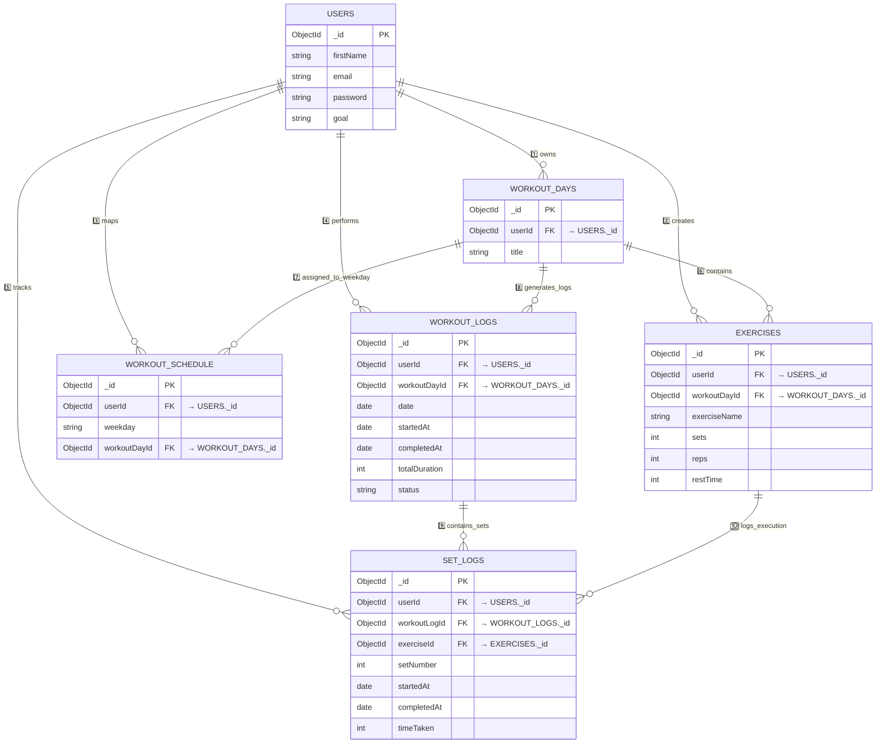

```mermaid
flowchart TB

%% ==============================
%% USER ENTRY
%% ==============================

U["User Opens App"]

%% ==============================
%% AUTH FLOW
%% ==============================

U --> A1["1. Signup / Login"]

A1 --> A2["2. AuthRouter"]
A2 --> A3["3. User Model"]
A3 --> A4["4. USERS Collection"]
A4 --> A5["5. Return JWT"]

%% ==============================
%% LOAD TODAY WORKOUT (SCHEDULE)
%% ==============================

A5 --> B1["6. GET /workout/suggestion"]

B1 --> B2["7. HistoryRouter"]
B2 --> B3["8. WorkoutSchedule Model"]
B3 --> B4["9. Find weekday mapping"]
B4 --> B5["10. Return WorkoutDay"]

%% ==============================
%% START WORKOUT
%% ==============================

B5 --> C1["11. Click Start Workout"]

C1 --> C2["12. POST /workout/start"]
C2 --> C3["13. WorkoutExecutionRouter"]
C3 --> C4["14. WorkoutLog Model"]
C4 --> C5["15. Create WORKOUT_LOG (status=in_progress)"]

%% ==============================
%% START SET
%% ==============================

C5 --> D1["16. POST /workout/set/start"]
D1 --> D2["17. SetLog Model"]
D2 --> D3["18. Create SET_LOG (startedAt)"]

%% ==============================
%% COMPLETE SET
%% ==============================

D3 --> E1["19. POST /workout/set/complete"]
E1 --> E2["20. Update SET_LOG"]
E2 --> E3["21. Calculate timeTaken"]

%% ==============================
%% COMPLETE WORKOUT
%% ==============================

E3 --> F1["22. POST /workout/complete"]
F1 --> F2["23. Update WORKOUT_LOG"]
F2 --> F3["24. Calculate totalDuration"]
F3 --> F4["25. status = completed"]

%% ==============================
%% HISTORY VIEW
%% ==============================

F4 --> G1["26. GET /workout/history"]
G1 --> G2["27. Fetch WORKOUT_LOGS + SET_LOGS"]
G2 --> G3["28. Return structured history"]
```

# 🏋️ FitFlow — Backend Data & API Understanding

This document explains the **role of every MongoDB collection** and **every API used in the FitFlow backend**.

The goal is to clearly understand:

* What each **collection stores**
* Which **APIs interact with it**
* Why that **collection or API exists in the system**

---

# 🧠 Backend System Layers

FitFlow backend can be understood in **4 logical layers**.

```
1️⃣ Identity Layer
   Users

2️⃣ Planning Layer
   WorkoutDays
   Exercises

3️⃣ Scheduling Layer
   WorkoutSchedule

4️⃣ Execution Layer
   WorkoutLogs
   SetLogs
```

Each layer serves a specific purpose in the workout lifecycle.

---

# 1️⃣ USERS Collection

## Purpose

The **Users collection stores all information about people using the platform.**

It represents the **identity of the user**.

Every other collection in the system is connected to a user.

---

## Data Stored

```
_id
firstName
lastName
email
password
profilePicture
age
height
weight
goal
createdAt
updatedAt
```

Example:

```
User: Rohit
Goal: muscle_gain
Height: 175 cm
Weight: 70 kg
```

---

## APIs That Use Users Collection

### POST `/signup`

Purpose:

Register a **new user on the platform**.

Flow:

```
User → /signup API
     → User Model
     → Store user in USERS collection
```

Example:

```
Rohit creates an account on FitFlow
```

---

### POST `/login`

Purpose:

Authenticate user and generate a **JWT token**.

Flow:

```
User → /login
     → Find user in USERS
     → Verify password
     → Generate JWT token
```

Example:

```
Rohit logs in to access his workouts
```

---

### POST `/logout`

Purpose:

End the current session.

Usually handled by:

```
Frontend removing JWT
or backend invalidating session
```

---

### GET `/profile/view`

Purpose:

Fetch the profile information of the logged-in user.

Flow:

```
JWT userId
→ Find user in USERS
→ Return profile data
```

---

### PATCH `/profile/edit`

Purpose:

Update profile information.

Example updates:

```
Change weight
Update goal
Update profile picture
```

---

# 2️⃣ WORKOUT_DAYS Collection

## Purpose

Defines **workout plans created by a user**.

Examples:

```
Chest Day
Back Day
Leg Day
Shoulder Day
```

These act as **workout templates**.

---

## Data Stored

```
_id
userId
title
createdAt
updatedAt
```

Example:

```
title: Chest Day
userId: Rohit
```

Meaning:

```
Rohit created a workout day called Chest Day
```

---

## APIs Using WorkoutDays

### POST `/workout/day`

Purpose:

Create a new workout day.

Example:

```
Create "Leg Day"
```

Flow:

```
User → API
     → WorkoutDay Model
     → Save in WorkoutDays collection
```

---

### GET `/workout/days`

Purpose:

Fetch all workout days for the logged-in user.

Example response:

```
Chest Day
Back Day
Leg Day
```

---

### DELETE `/workout/day/:id`

Purpose:

Delete an existing workout day.

Example:

```
Delete old Chest Day plan
```

---

# 3️⃣ EXERCISES Collection

## Purpose

Stores **exercises inside each workout day**.

Example:

```
Chest Day
   → Bench Press
   → Incline Dumbbell Press
   → Chest Fly
```

Each exercise contains **training details**.

---

## Data Stored

```
_id
userId
workoutDayId
exerciseName
imageUrl
sets
reps
restTime
notes
```

Example:

```
Exercise: Bench Press
Sets: 4
Reps: 10
Rest: 90 seconds
```

---

## APIs Using Exercises

### POST `/exercise`

Purpose:

Add an exercise to a workout day.

Example:

```
Add Bench Press to Chest Day
```

Flow:

```
User → API
     → Exercise Model
     → Save in Exercises collection
```

---

### GET `/exercise/:dayId`

Purpose:

Fetch exercises for a specific workout day.

Example:

```
Chest Day → return exercises
```

Response:

```
Bench Press
Incline Dumbbell Press
Chest Fly
```

---

### PATCH `/exercise/:id`

Purpose:

Update exercise details.

Example:

```
Bench Press
sets: 4 → 5
```

---

### DELETE `/exercise/:id`

Purpose:

Remove an exercise from a workout day.

Example:

```
Remove Chest Fly
```

---

# 4️⃣ WORKOUT_SCHEDULE Collection

## Purpose

Maps **weekday to workout plan**.

Example weekly plan:

```
Monday → Chest Day
Tuesday → Back Day
Wednesday → Rest
Thursday → Legs
Friday → Shoulders
```

This tells the app:

```
What workout should the user perform today?
```

---

## Data Stored

```
_id
userId
weekday
workoutDayId
createdAt
updatedAt
```

Example:

```
weekday: monday
workoutDayId: Chest Day
```

---

## APIs Using WorkoutSchedule

### POST `/schedule/set`

Purpose:

Assign workout day to a weekday.

Example:

```
Monday → Chest Day
```

Flow:

```
User → API
     → WorkoutSchedule Model
     → Store mapping
```

---

### GET `/schedule/view`

Purpose:

View weekly workout schedule.

Example response:

```
Mon → Chest
Tue → Back
Wed → Rest
Thu → Legs
```

---

### PATCH `/schedule/:id`

Purpose:

Update weekday mapping.

Example:

```
Monday
Chest Day → Shoulder Day
```

---

### DELETE `/schedule/:id`

Purpose:

Remove schedule mapping.

Example:

```
Remove Monday workout
```

---

# 5️⃣ WORKOUT_LOGS Collection

## Purpose

Stores **each workout session performed by the user**.

This represents **workout history**.

Example:

```
March 10
Chest Day workout performed
```

---

## Data Stored

```
_id
userId
workoutDayId
date
startedAt
completedAt
totalDuration
totalExercises
totalSetsCompleted
status
```

Example:

```
Date: March 10
Workout: Chest Day
Started: 6:00 PM
Completed: 6:50 PM
Duration: 50 minutes
Status: completed
```

---

## APIs Using WorkoutLogs

### POST `/workout/start`

Purpose:

Start a workout session.

Flow:

```
User clicks Start Workout
→ Create WorkoutLog
→ status = in_progress
```

---

### POST `/workout/complete`

Purpose:

Finish workout session.

Backend calculates:

```
totalDuration
```

Then updates:

```
status = completed
```

---

# 6️⃣ SET_LOGS Collection

## Purpose

Stores **every set performed in a workout**.

Example:

```
Bench Press
Set 1
Set 2
Set 3
```

Each set records execution time.

---

## Data Stored

```
_id
userId
workoutLogId
exerciseId
setNumber
startedAt
completedAt
timeTaken
```

Example:

```
Exercise: Bench Press
Set: 1
Time taken: 30 seconds
```

---

## APIs Using SetLogs

### POST `/workout/set/start`

Purpose:

Start tracking a set.

Flow:

```
User starts set
→ Create SetLog
→ Store startedAt
```

---

### POST `/workout/set/complete`

Purpose:

Complete a set.

Backend calculates:

```
timeTaken
```

Then updates the SetLog record.

---

# 7️⃣ HISTORY APIs

These APIs **read execution data**.

---

### GET `/workout/history`

Purpose:

Fetch all past workouts.

Example response:

```
March 8 → Chest Day
March 6 → Leg Day
March 5 → Back Day
```

Uses:

```
WorkoutLogs
SetLogs
```

---

### GET `/workout/last`

Purpose:

Fetch the most recent workout.

Example:

```
Last workout: Chest Day
```

---

### GET `/workout/suggestion`

Purpose:

Suggest workout for today.

Logic:

```
Find today's weekday
→ check WorkoutSchedule
→ return mapped workoutDay
```

Uses:

```
WorkoutSchedule
WorkoutDays
```

---

# 🧠 Complete Backend Mental Model

```
USER
 ↓

PLAN
WorkoutDays
   ↓
Exercises

SCHEDULE
WorkoutSchedule

EXECUTE
WorkoutLogs
   ↓
SetLogs

ANALYZE
History APIs
```

---

# 🎯 Final Summary

FitFlow backend is built around **four core concepts**:

### Identity

```
Users
```

### Planning

```
WorkoutDays
Exercises
```

### Scheduling

```
WorkoutSchedule
```

### Execution

```
WorkoutLogs
SetLogs
```

Together they create a system that allows users to:

```
Plan workouts
Schedule them
Execute workouts
Track performance history
```

This architecture also prepares the system for future features like:

```
Workout analytics
Progress tracking
Streak tracking
AI workout suggestions
```

---


# 🧩 Database Relationship Diagram

Now hierarchy is 100% aligned with latest architecture.



---

# 🧠 Clean Hierarchy Memory Structure

### 🔹 Planning Layer

```
User
 ↓
WorkoutDays
 ↓
Exercises
```

### 🔹 Scheduling Layer

```
User
 ↓
WorkoutSchedule
 ↓
Maps weekday → WorkoutDay
```

### 🔹 Execution Layer

```
WorkoutDay
 ↓
WorkoutLog
 ↓
SetLogs
```

---

# 🏋️ Updated Backend Execution Flow (With Schedule Layer)

Now we improve your previous flow by inserting:

* Schedule suggestion logic
* Set start + complete separation
* Proper model mapping

---



---

# 🎯 Updated Clean API → Model → DB Flow

## 🔐 Authentication

```
User → AuthRouter → User Model → USERS
```

---

## 📅 Schedule Mapping

```
User → ScheduleRouter → WorkoutSchedule Model → WORKOUT_SCHEDULE
```

---

## 🏋️ Start Workout

```
User → WorkoutExecutionRouter
     → WorkoutLog Model
     → WORKOUT_LOGS
```

---

## ⏱ Start Set

```
User → WorkoutExecutionRouter
     → SetLog Model
     → SET_LOGS (startedAt)
```

---

## ✅ Complete Set

```
User → WorkoutExecutionRouter
     → Update SetLog
     → timeTaken calculated
```

---

## 🏁 Complete Workout

```
User → WorkoutExecutionRouter
     → Update WorkoutLog
     → totalDuration calculated
```

---

# 🧠 Final Backend Logical Layers (Now Fully Accurate)

### 1️⃣ Planning System

WorkoutDays + Exercises

### 2️⃣ Scheduling System

WorkoutSchedule (weekday mapping)

### 3️⃣ Execution Engine

WorkoutLogs + SetLogs

### 4️⃣ Analytics Foundation

History + Suggestion APIs

---

# 🚀 Final Mental Model (Latest Architecture)

If you forget everything:

```
PLAN
  WorkoutDays → Exercises

SCHEDULE
  WorkoutSchedule → weekday mapping

EXECUTE
  WorkoutLogs → SetLogs

ANALYZE
  History → Suggestion
```

---