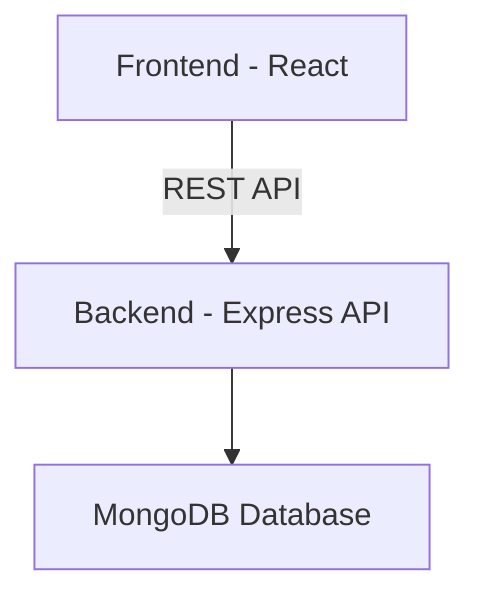
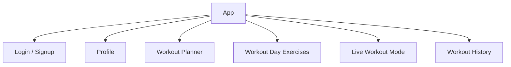

---

# 🏋️‍♂️ FitFlow — Architecture, HLD, LLD & Folder Structure

**Tagline:** Plan your workouts. Execute with discipline. Track your progress. Stay consistent.

---

## 🛠️ Tech Stack

### **Frontend (Client / Presentation Layer)**

* React + Vite
* TailwindCSS / Material UI
* Axios (REST API calls)
* Local Timer Logic (Set + Workout duration)
* Optional: Service Workers / Notifications

### **Backend (Server / Application Layer)**

* Node.js + Express.js
* MongoDB (Database)
* JWT (Authentication)
* Business Logic Layer (Workout Execution State Management)

**Microservices:**

> Single backend service (monolithic architecture) — clean & scalable
> Frontend is a client application

---

## 🔧 Work of Layers

### **Frontend**

* Shows workout planner UI
* Manages workout day & exercise management
* Handles live workout timer UI
* Manages set-level timer
* Sends execution events (start, setComplete, complete)
* Shows logs & history
* Calls backend APIs

### **Backend**

* Authentication & user handling
* Workout day & exercise CRUD logic
* Workout execution state management
* Time validation & duration calculation
* Workout logging & analytics foundation
* History & suggestion logic

### **Database Layer**

* Collections:

  * Users
  * WorkoutDays
  * Exercises
  * WorkoutSchedule
  * WorkoutLogs
  * SetLogs

---

## 🏗️ High-Level Design (HLD)



### **HLD Summary:**

* Frontend manages UI & timers
* Backend manages authentication + business rules + execution state
* MongoDB stores structured workout & execution logs
* Single backend application — simple, scalable & maintainable

---

## 📐 Low-Level Design (LLD)

### **Database Design**

---

### **1️⃣ Users Collection**

```
{
  _id,
  firstName,
  lastName,
  email,
  password,
  profilePicture,
  age,
  height,
  weight,
  goal,  // muscle_gain, fat_loss, strength
  createdAt,
  updatedAt
}
```

---

### **2️⃣ WorkoutDays Collection**

```
{
  _id,
  userId,
  title,
  createdAt,
  updatedAt
}
```

---

### **3️⃣ Exercises Collection**

```
{
  _id,
  userId,
  workoutDayId,
  exerciseName,
  imageUrl,
  sets,
  reps,
  restTime,
  notes
}
```

---

### **4️⃣ WorkoutSchedule Collection**

Maps weekday → workoutDay

```
{
  _id,
  userId,
  weekday,      // "monday", "tuesday"
  workoutDayId,
  createdAt,
  updatedAt
}
```

---

### **5️⃣ WorkoutLogs Collection**

Stores runtime workout session.

```
{
  _id,
  userId,
  workoutDayId,
  date,
  startedAt,
  completedAt,
  totalDuration,        // calculated at completion
  totalExercises,
  totalSetsCompleted,
  status  // in_progress / completed / skipped
}
```

---

### **6️⃣ SetLogs Collection**

Stores per-set execution tracking.

```
{
  _id,
  userId,
  workoutLogId,
  exerciseId,
  setNumber,
  startedAt,
  completedAt,
  timeTaken   // seconds or ms
}
```

---

## 🔗 API Endpoints

### **AuthRouter**

| Method | Endpoint | Description       |
| ------ | -------- | ----------------- |
| POST   | /signup  | Register new user |
| POST   | /login   | Login user        |
| POST   | /logout  | Logout user       |

---

### **ProfileRouter**

| Method | Endpoint      | Description  |
| ------ | ------------- | ------------ |
| GET    | /profile/view | Get profile  |
| PATCH  | /profile/edit | Edit profile |

---

### **WorkoutDayRouter**

| Method | Endpoint         | Description        |
| ------ | ---------------- | ------------------ |
| POST   | /workout/day     | Create workout day |
| GET    | /workout/days    | Get workout days   |
| DELETE | /workout/day/:id | Delete workout day |

---

### **ExerciseRouter**

| Method | Endpoint         | Description             |
| ------ | ---------------- | ----------------------- |
| POST   | /exercise        | Add exercise            |
| GET    | /exercise/:dayId | Get exercises for a day |
| PATCH  | /exercise/:id    | Update exercise         |
| DELETE | /exercise/:id    | Delete exercise         |

---

### **Schedule Router**

| Method | Endpoint       | Description               |
| ------ | -------------- | ------------------------- |
| POST   | /schedule/set  | Assign workout to weekday |
| GET    | /schedule/view | Get weekly schedule       |
| PATCH  | /schedule/:id  | Update mapping            |
| DELETE | /schedule/:id  | Remove schedule           |

---

### **Workout Execution Router**

Handles runtime workout state transitions.

| Method | Endpoint             | Description                   |
| ------ | -------------------- | ----------------------------- |
| POST   | /workout/start       | Create in_progress WorkoutLog |
| POST   | /workout/setStart    | Start a set (store startedAt) |
| POST   | /workout/setComplete | Complete a set & log time     |
| POST   | /workout/complete    | Mark workout completed        |

---

### **History Router**

| Method | Endpoint            | Description           |
| ------ | ------------------- | --------------------- |
| GET    | /workout/history    | Get workout history   |
| GET    | /workout/last       | Get last workout      |
| GET    | /workout/suggestion | Suggest today workout |

---

## 🖼️ Frontend Component Diagram



---

## 📂 Folder Structure – FitFlow

```
FitFlow/
│
├── src/
│   │   ApiList.md
│   │   app.js
│   │
│   ├── config/
│   │       database.js
│
│   ├── middlewares/
│   │       auth.js
│
│   ├── models/
│   │       user.js
│   │       workoutDay.js
│   │       exercise.js
│   │       workoutSchedule.js
│   │       workoutLog.js
│   │       setLog.js
│
│   ├── routes/
│   │       authRouter.js
│   │       profileRouter.js
│   │       workoutDayRouter.js
│   │       exerciseRouter.js
│   │       scheduleRouter.js
│   │       workoutExecutionRouter.js
│   │       historyRouter.js
│
│   └── utils/
│           validation.js
│
├── .env
├── package.json
└── README.md
```

---

## 🌟 Optional Advanced Features

* Streak tracking
* Charts / Analytics
* Notifications
* Gamification badges
* AI workout suggestion (future)
* MongoDB transactions for execution integrity

---

# 🎯 Summary

FitFlow is a discipline-focused structured workout system:

* Planning layer (WorkoutDays + Exercises)
* Scheduling layer (WorkoutSchedule)
* Execution layer (WorkoutLogs + SetLogs)
* Analytics-ready foundation
* Clean backend state management

---