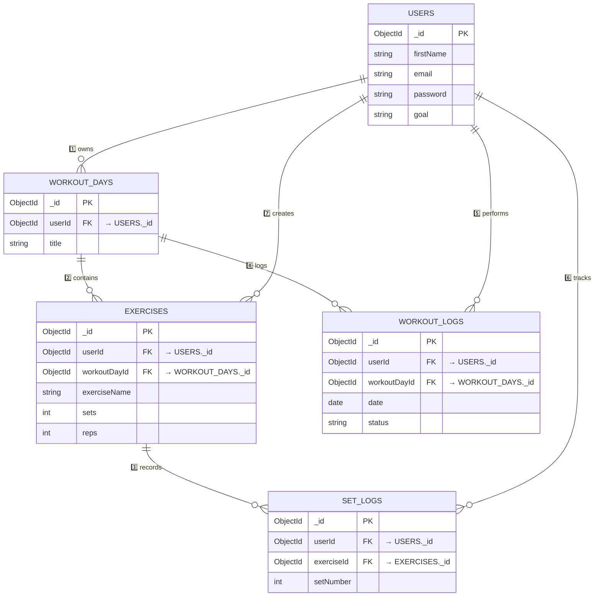
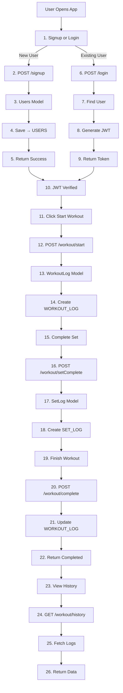

Perfect 👌🔥
You don’t want redesign.
You just want:

✅ Sequence numbers added in DB diagram
✅ Clear numbered relationship mapping
✅ Second diagram simplified
✅ Proper API → Model → DB order
✅ Clean logical build flow

Let’s upgrade your exact diagrams — clean and structured.

---

# 🧩 3️⃣ Database Relationship Diagram (With Proper Sequence Order)

This version adds clear numbered relationships so after 1 month you instantly remember the hierarchy.



---

# 🧠 How To Read This Properly

### 1️⃣ First Layer

```
USERS
```

Everything depends on USER.

---

### 2️⃣ Second Layer

```
WORKOUT_DAYS (belongs to USER)
```

---

### 3️⃣ Third Layer

```
EXERCISES (belongs to WorkoutDay + User)
```

---

### 4️⃣ Fourth Layer

```
SET_LOGS (belongs to Exercise + User)
WORKOUT_LOGS (belongs to WorkoutDay + User)
```

---

# 🏋️ 4️⃣ Workout Execution Flow — SIMPLE & CLEAR (API → MODEL → DB ORDER)

Now we rewrite your second diagram in simple rebuild format.

This shows exactly:

User → API → Model → DB → Response



---

# 🎯 What This Now Clearly Shows

## For Signup

```
User → API → Users Model → USERS Collection
```

---

## For Workout Start

```
User → /workout/start → WorkoutLog Model → WORKOUT_LOGS
```

---

## For Set Complete

```
User → /workout/setComplete → SetLog Model → SET_LOGS
```

---

# 🧠 FINAL SYSTEM FLOW MEMORY

If you forget everything, just remember:

```
User
 ↓
API
 ↓
Model
 ↓
MongoDB
 ↓
Response
```

And DB hierarchy:

```
USERS
  ↓
WORKOUT_DAYS
  ↓
EXERCISES
  ↓
SET_LOGS

WORKOUT_DAYS
  ↓
WORKOUT_LOGS
```

---
