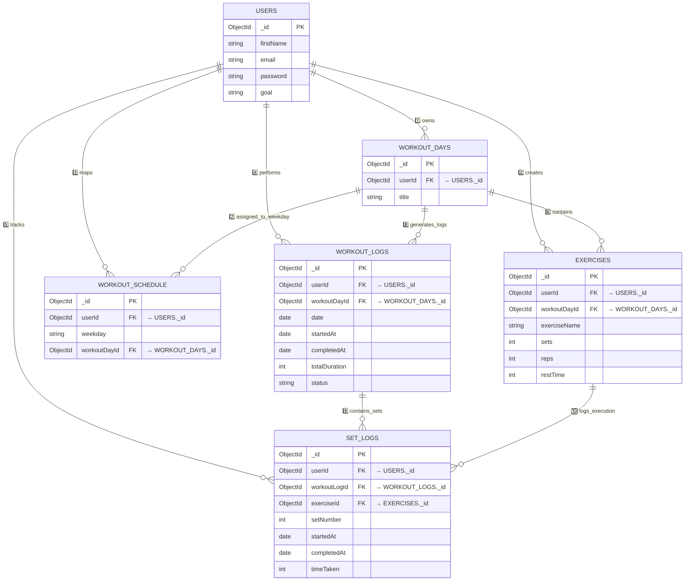

```mermaid
flowchart TB

%% ==============================
%% USER ENTRY
%% ==============================

U["User Opens App"]

%% ==============================
%% AUTH FLOW
%% ==============================

U --> A1["1. Signup / Login"]

A1 --> A2["2. AuthRouter"]
A2 --> A3["3. User Model"]
A3 --> A4["4. USERS Collection"]
A4 --> A5["5. Return JWT"]

%% ==============================
%% LOAD TODAY WORKOUT (SCHEDULE)
%% ==============================

A5 --> B1["6. GET /workout/suggestion"]

B1 --> B2["7. HistoryRouter"]
B2 --> B3["8. WorkoutSchedule Model"]
B3 --> B4["9. Find weekday mapping"]
B4 --> B5["10. Return WorkoutDay"]

%% ==============================
%% START WORKOUT
%% ==============================

B5 --> C1["11. Click Start Workout"]

C1 --> C2["12. POST /workout/start"]
C2 --> C3["13. WorkoutExecutionRouter"]
C3 --> C4["14. WorkoutLog Model"]
C4 --> C5["15. Create WORKOUT_LOG (status=in_progress)"]

%% ==============================
%% START SET
%% ==============================

C5 --> D1["16. POST /workout/set/start"]
D1 --> D2["17. SetLog Model"]
D2 --> D3["18. Create SET_LOG (startedAt)"]

%% ==============================
%% COMPLETE SET
%% ==============================

D3 --> E1["19. POST /workout/set/complete"]
E1 --> E2["20. Update SET_LOG"]
E2 --> E3["21. Calculate timeTaken"]

%% ==============================
%% COMPLETE WORKOUT
%% ==============================

E3 --> F1["22. POST /workout/complete"]
F1 --> F2["23. Update WORKOUT_LOG"]
F2 --> F3["24. Calculate totalDuration"]
F3 --> F4["25. status = completed"]

%% ==============================
%% HISTORY VIEW
%% ==============================

F4 --> G1["26. GET /workout/history"]
G1 --> G2["27. Fetch WORKOUT_LOGS + SET_LOGS"]
G2 --> G3["28. Return structured history"]
```

# 🧩 3️⃣ Updated Database Relationship Diagram (With WorkoutSchedule)

Now hierarchy is 100% aligned with latest architecture.



---

# 🧠 Clean Hierarchy Memory Structure

### 🔹 Planning Layer

```
User
 ↓
WorkoutDays
 ↓
Exercises
```

### 🔹 Scheduling Layer

```
User
 ↓
WorkoutSchedule
 ↓
Maps weekday → WorkoutDay
```

### 🔹 Execution Layer

```
WorkoutDay
 ↓
WorkoutLog
 ↓
SetLogs
```

---

# 🏋️ Updated Backend Execution Flow (With Schedule Layer)

Now we improve your previous flow by inserting:

* Schedule suggestion logic
* Set start + complete separation
* Proper model mapping

---



---

# 🎯 Updated Clean API → Model → DB Flow

## 🔐 Authentication

```
User → AuthRouter → User Model → USERS
```

---

## 📅 Schedule Mapping

```
User → ScheduleRouter → WorkoutSchedule Model → WORKOUT_SCHEDULE
```

---

## 🏋️ Start Workout

```
User → WorkoutExecutionRouter
     → WorkoutLog Model
     → WORKOUT_LOGS
```

---

## ⏱ Start Set

```
User → WorkoutExecutionRouter
     → SetLog Model
     → SET_LOGS (startedAt)
```

---

## ✅ Complete Set

```
User → WorkoutExecutionRouter
     → Update SetLog
     → timeTaken calculated
```

---

## 🏁 Complete Workout

```
User → WorkoutExecutionRouter
     → Update WorkoutLog
     → totalDuration calculated
```

---

# 🧠 Final Backend Logical Layers (Now Fully Accurate)

### 1️⃣ Planning System

WorkoutDays + Exercises

### 2️⃣ Scheduling System

WorkoutSchedule (weekday mapping)

### 3️⃣ Execution Engine

WorkoutLogs + SetLogs

### 4️⃣ Analytics Foundation

History + Suggestion APIs

---

# 🚀 Final Mental Model (Latest Architecture)

If you forget everything:

```
PLAN
  WorkoutDays → Exercises

SCHEDULE
  WorkoutSchedule → weekday mapping

EXECUTE
  WorkoutLogs → SetLogs

ANALYZE
  History → Suggestion
```

---