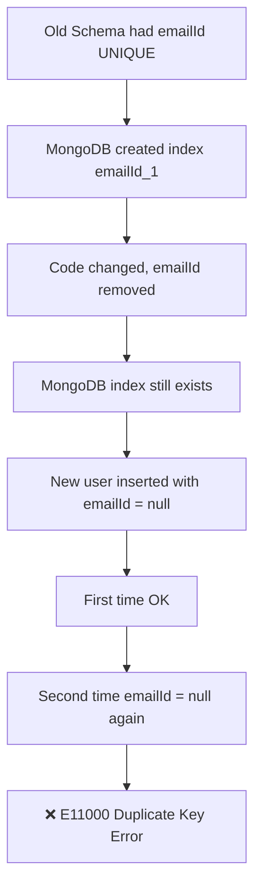

# 🚨 MongoDB Duplicate Key Error (`emailId_1`) – Explained & Fixed

🧠 **Topic:** MongoDB / Mongoose  
🐞 **Error Type:** Duplicate Key Error (`E11000`)  
🎯 **Goal:** Understand the problem ONCE and never get stuck again  

---

## ❌ The Error I Faced

```

E11000 duplicate key error
collection: FitFlowDB.users
index: emailId_1
dup key: { emailId: null }

````

At first glance, this error is **very confusing** because:

- ❓ There is **no `emailId` in my current code**
- ❓ Still MongoDB is complaining about `emailId`

---

## 🤯 Why This Error Happens (The ONE REAL REASON)

> 🔥 **MongoDB still has an OLD UNIQUE INDEX on `emailId`**
> even though the field no longer exists in the code.

### Important Truth 🧠

> **Changing Mongoose schema does NOT automatically change MongoDB indexes**

MongoDB **remembers indexes forever** unless you delete them manually.

---

## 🕰️ What Actually Happened (Timeline)

1️⃣ Earlier, the schema had a field like:

```js
emailId: {
  type: String,
  unique: true
}
````

2️⃣ MongoDB created a unique index:

```
emailId_1
```

3️⃣ Later, the code was changed:

* `emailId` was renamed to `email`
* or completely removed

4️⃣ ❌ But MongoDB index was NEVER removed

5️⃣ Now every new user has:

```js
emailId: null
```

6️⃣ MongoDB allows **only ONE `null`** in a UNIQUE index

💥 Second insert → **CRASH**

---

## 🧩 Visual Explanation (Mermaid Diagram)



---

## 🔍 Common Mistake I Made

❌ I ran Mongo commands in the **wrong database (`test`)**

MongoDB shell defaults to `test` DB, but my real DB was:

```
FitFlowDB
```

---

## ✅ Correct & Final Solution (Step-by-Step)

### 1️⃣ Switch to the correct database

```js
use FitFlowDB
```

✔ Mongo will respond:

```
switched to db FitFlowDB
```

---

### 2️⃣ Check existing indexes

```js
db.users.getIndexes()
```

You will likely see:

```js
{ name: "emailId_1", unique: true }
```

---

### 3️⃣ ❗ Drop the OLD index (MAIN FIX)

```js
db.users.dropIndex("emailId_1")
```

✔ Problem solved
✔ MongoDB no longer checks `emailId`

---

### 4️⃣ (Optional but Recommended) Clean bad data

```js
db.users.deleteMany({ emailId: null })
```

---

### 5️⃣ Restart your backend server

So Mongoose reloads schema & indexes correctly.

---

## ✅ Final Recap (Remember Forever 🧠🔥)

* ❌ Error is NOT from current code
* ❌ Error is NOT from Express or Node
* ❌ Error is NOT from validation
* ✅ Error is from an **OLD MongoDB UNIQUE INDEX**
* ✅ MongoDB indexes **do not auto-delete**
* ✅ Always check the **correct database name**

---

## 🏆 One-Line Golden Rule

> **MongoDB remembers history.
> Your code does not.**

---

## 📌 When You See This Again, Do This Immediately

1. Check error → look for `index: something_1`
2. Switch to correct DB → `use <dbName>`
3. Run → `db.collection.getIndexes()`
4. Drop the old index → `dropIndex()`

---

