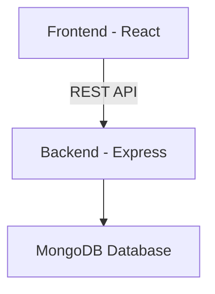

# 🏋️‍♂️ FitFlow

> **Plan your workouts. Execute with discipline. Track your progress. Stay consistent.**

---

## 🚀 Project Overview
FitFlow is a modern, full-stack workout tracking platform for gym lovers and home workout enthusiasts. It helps you:

- 📅 Plan structured workouts
- 🏋️ Execute workouts in real-time
- 📊 Track progress & history
- ⚡ Manage workout state intelligently

> **⚠️ This project is still in progress!**

---

## 🛠️ Tech Stack

### Backend
<p align="left">
  
  
  
  
</p>

### Frontend
<p align="left">
  
  
  
  
  
  
</p>

---

## 🏗️ Architecture



---

## ✨ Key Features
- JWT-based authentication
- Workout planning (days, exercises, sets, reps)
- Weekly scheduling
- Real-time workout execution & set tracking
- Workout history & analytics foundation
- Smart suggestions for today's workout

---

## 📂 Folder Structure

### Backend
```
Backend/
├── config/
├── middlewares/
├── models/
├── routes/
├── utils/
├── app.js
├── package.json
```

### Frontend
```
Frontend/
├── public/
├── src/
│   ├── assets/
│   ├── components/
│   ├── pages/
│   ├── layouts/
│   ├── router/
│   ├── redux/
│   ├── services/
│   ├── utils/
│   ├── hooks/
│   ├── styles/
│   ├── App.jsx
│   └── main.jsx
├── docs/
├── package.json
```

---

## 💡 Project Idea
FitFlow empowers users to:
- Plan personalized workout routines
- Schedule workouts for each weekday
- Execute workouts with real-time set tracking
- Analyze progress and maintain consistency

The architecture is designed for scalability, clean separation of concerns, and future enhancements like analytics, streak tracking, and AI-powered suggestions.

---

## 📈 Status
**This project is actively being developed and is not yet production-ready.**

---

## 👨‍💻 Author
Built with discipline by **Ophid**
