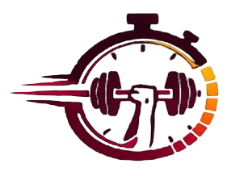
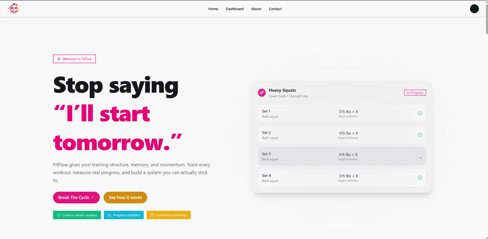
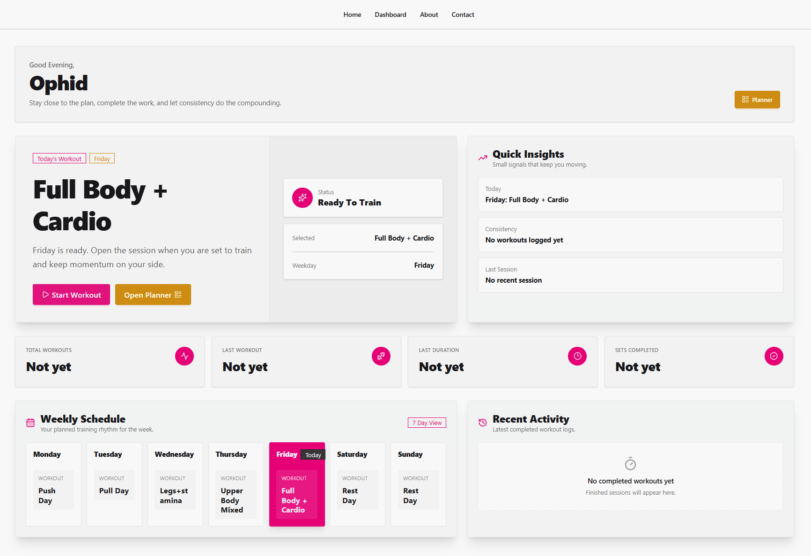
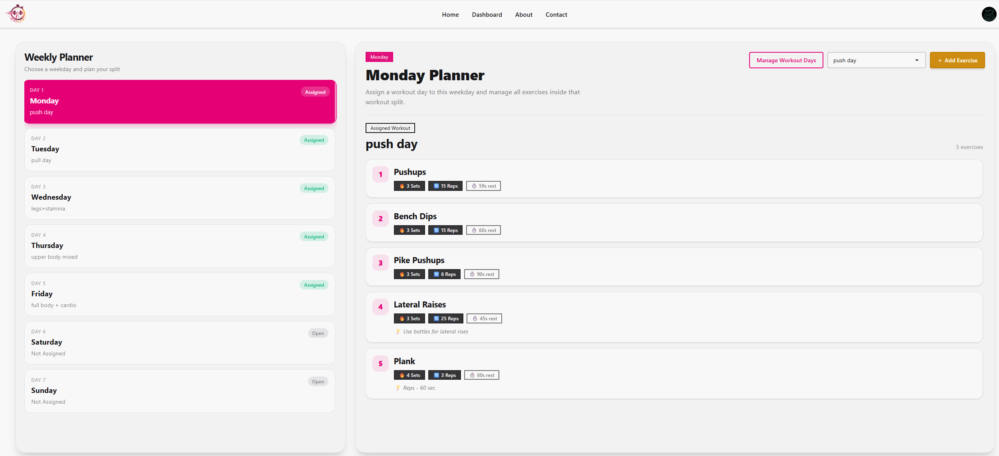
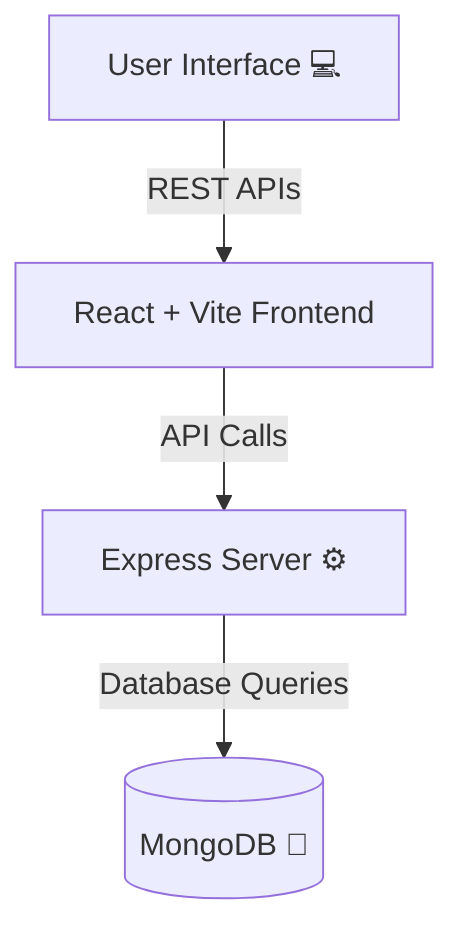

# 🏋️ FitFlow

<p align="center">
  
</p>

> **Elevate your fitness journey, one rep at a time!**  
> FitFlow is a modern **MERN Stack** web application designed to help you plan workouts, track your progress, and stay motivated on your path to a healthier lifestyle 🚀💪.

<p align="center">
  <b>🔗 <a href="https://fitflow-flame.vercel.app/">Live Demo: fitflow-flame.vercel.app</a></b>
</p>

---

## 🚧 Status: Ongoing Project
> **Note:** FitFlow is currently under **active development**. Exciting new features are being built and added regularly! ✨

### ✅ What's Built So Far
- 📊 **Interactive Dashboard:** A comprehensive view of your fitness stats, current progress, and upcoming routines.
- 🗓️ **Workout Planner:** Plan your exercise routines, target specific muscle groups, and schedule them seamlessly.
- 🏃 **Live Workout Sessions:** Execute, track, and log your active workouts in real-time.
- ⚙️ **Backend Integration:** Robust REST APIs supporting workout execution routing, data management, and user sessions.
- 🎨 **Modern UI:** Clean, responsive, and aesthetically pleasing interface built with React and modern styling libraries.

---

## 🖼️ Sneak Peek Preview

### 🏠 Home Page
<p align="center">
  <!-- TODO: Replace src with actual Home Page Image path -->
  
</p>

### 📈 Dashboard
<p align="center">
  <!-- TODO: Replace src with actual Dashboard Image path -->
  
</p>

### 🗓️ Workout Planner
<p align="center">
  <!-- TODO: Replace src with actual Planner Image path -->
  
</p>

---

## 🚀 Tech Stack

### 🖥️ Frontend


### ⚙️ Backend


---

## 🧠 Architecture



---

## ⚡ Folder Structure (Current)

```
FitFlow/
│
├── 📁 Backend/           # Node + Express + MongoDB
│   ├── src/
│   │   ├── routes/
│   │   │   └── workoutExecutionRouter.js
│   │   └── ...
│   └── ...
│
├── 📁 Frontend/          # React + Vite + Modern UI Libraries
│   ├── src/
│   │   ├── pages/
│   │   │   ├── Dashboard.jsx
│   │   │   ├── WorkoutSession.jsx
│   │   │   └── ...
│   │   └── ...
│   └── ...
│
└── README.md
```

---

## 🧰 Installation & Setup

### 🔹 1. Clone the repository

```bash
git clone https://github.com/Ophidev/FitFlow.git
cd FitFlow
```

### 🔹 2. Setup the Backend

```bash
cd Backend
npm install
```

Create a `.env` file in the Backend directory:

```env
MONGODB_CONNECTION_STRING= your mongodb connection string
JWT_SECRET= your jwt secret key
PORT = your port number
PROD_FRONTEND_URL= your production frontend url
```

### 🔹 3. Setup the Frontend

```bash
cd Frontend
npm install
```

Create a `.env` file in the Frontend directory to connect to your backend:

```env
VITE_BASE_URL=http://localhost:5000
```

### 🔹 4. Run the Full Application (Concurrently)

FitFlow is configured to run both the frontend and backend simultaneously from the root directory to save time!

First, make sure you are in the root directory (`FitFlow`) and install the root dependencies:
```bash
npm install
```

Then, start both servers with a single command:
```bash
npm run dev
```

> **💡 How it works:** This command uses the `concurrently` package (configured in the root `package.json`) to execute `"npm run backend"` and `"npm run frontend"` at the exact same time in one terminal window.

* Frontend → `http://localhost:5173`
* Backend → `http://localhost:5000`

---

## 🌐 Live Demo & Deployment

* **Live Demo:** [https://fitflow-flame.vercel.app/](https://fitflow-flame.vercel.app/)
* **Frontend Hosting:** Vercel

---

## 🧑💻 Author

**👤 Ophidev**  
💼 MERN Developer | 🚀 DevOps Learner  
🔗 [GitHub](https://github.com/Ophidev)

---

## ⭐ Support

If you like how **FitFlow** is shaping up, please consider giving this repository a **⭐ star**. Your support fuels the motivation to keep building awesome features! 🙌
